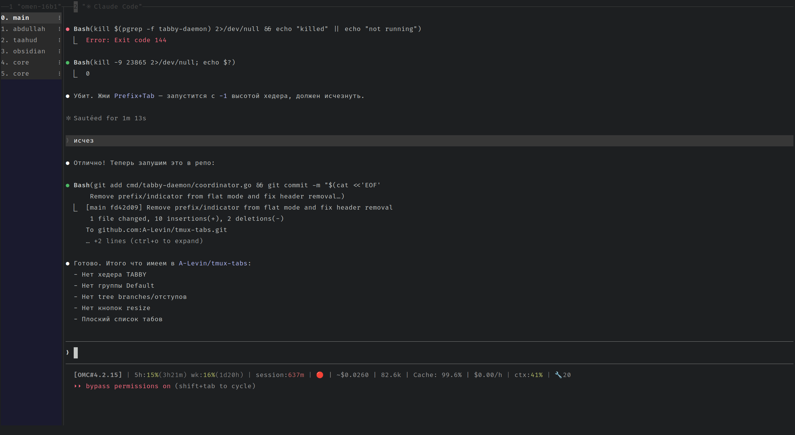

# tmux-tabs

A vertical tab sidebar for tmux. Fork of [brendandebeasi/tabby](https://github.com/brendandebeasi/tabby) with a minimalist UI.



## Patches in this fork

- No sidebar header (TABBY label removed)
- No group labels (flat window list)
- No tree branches / active indicator indent
- No resize buttons (`disable_large_mode: true`)
- `hide_group_labels` config option added to `Sidebar`
- Header skipped when `height: -1`

## Installation

```bash
git clone https://github.com/A-Levin/tmux-tabs ~/.tmux/plugins/tabby
cd ~/.tmux/plugins/tabby
./scripts/install.sh
```

Add to `~/.tmux.conf`:
```bash
run-shell ~/.tmux/plugins/tabby/tabby.tmux
```

## Minimal config

`~/.config/tabby/config.yaml`:

```yaml
position: left
height: 1

terminal_title:
  enabled: true
  format: "tmux #{window_index} #{window_name}"

style:
  rounded: false
  separator_left: ""
  separator_right: ""

overflow:
  mode: scroll
  indicator: "›"

groups:
  - name: "Default"
    pattern: ".*"
    theme:
      bg: "#2a2a2a"
      active_bg: "#3a3a3a"
      icon: ""
      active_indicator_bg: "#555555"

sidebar:
  disable_large_mode: true
  touch_mode: false
  hide_group_labels: true
  header:
    text: ""
    height: -1
    padding_bottom: 0
  pane_headers: false
  new_tab_button: false
  new_group_button: false
  show_empty_groups: false
  close_button: false
  sort_by: "index"
  theme: dark
  colors:
    inactive_fg: "#aaaaaa"
    active_indicator_frames: ["▌", " "]
    active_indicator_fg: "#ffffff"
    active_indicator_bg: "transparent"

indicators:
  activity:
    enabled: false
  bell:
    enabled: false
  silence:
    enabled: false
  busy:
    enabled: false
  input:
    enabled: false
```

## Usage

| Key | Action |
|-----|--------|
| `prefix + Tab` | Toggle sidebar |
| `prefix + n` | Next window |
| `prefix + p` | Previous window |
| `prefix + c` | New window |
| `prefix + x` | Kill pane |
| `prefix + ,` | Rename window |

## Building from source

```bash
cd ~/.tmux/plugins/tabby
go build -o bin/tabby-daemon ./cmd/tabby-daemon
```

## License

MIT
